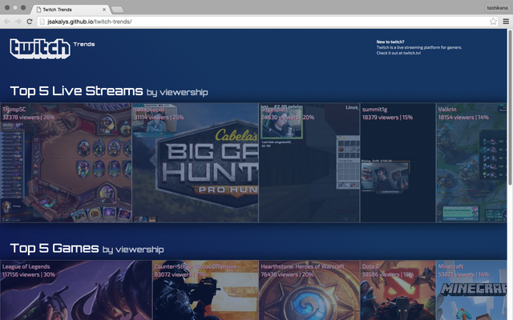

## Twitch Trends
Twitch Trends is a one-pager I whipped up using D3.js to visualize real-time viewership trends in Twitch. It queries the Twitch API for the top 5 streams in several categories and displays them in proportion to their respective viewership.

### Credits
* [Twitch Developers Program](http://dev.twitch.tv/)
* [D3.js](http://http://d3js.org/)
* [Twitter Bootstrap](http://getbootstrap.com/)
* [Font Awesome](https://fortawesome.github.io/Font-Awesome/)
* [Google Web Fonts (Exo 2 and Orbitron)](https://www.google.com/fonts)
* [Subtle Patterns (Squairy Light)](http://subtlepatterns.com/squairy/)
